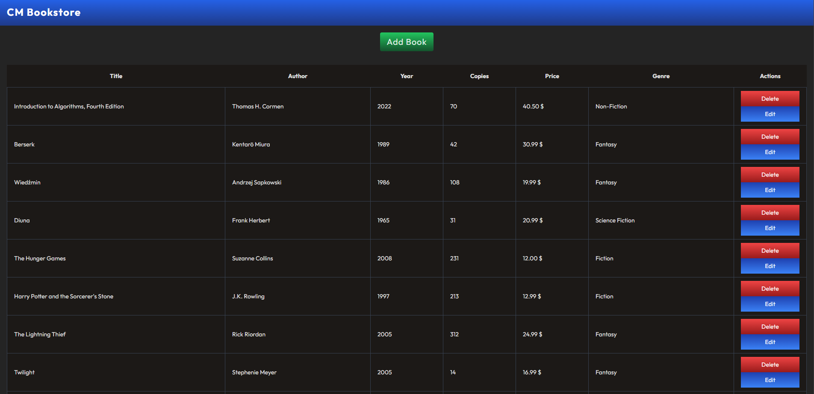
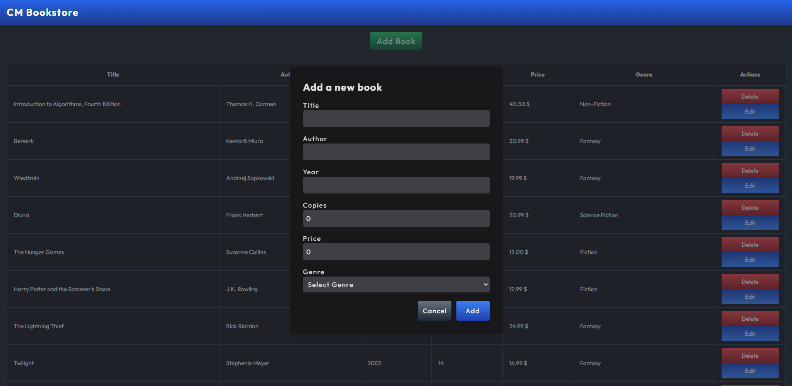
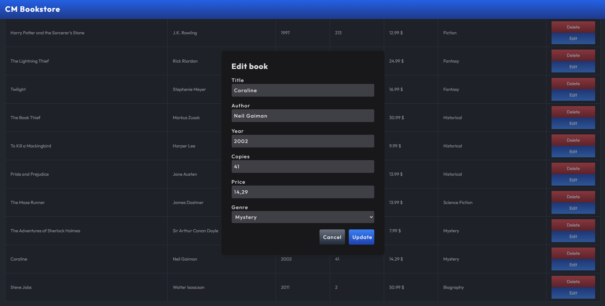
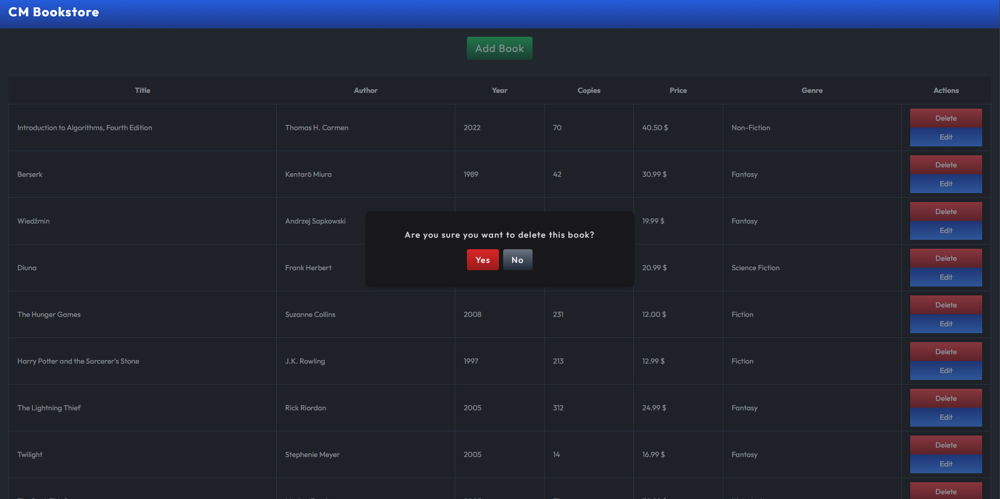

# Pracownia: Księgarnia (10p)
> https://github.com/Arsenicro/uwr2024-react/blob/main/Lecture11/Lab/Lab.md

Twoim zadaniem na tej liście będzie stworzenie prostego CRUDa (Create Read Update Delete) księgarni z pomocą [tanstack query](https://tanstack.com/query/latest)

Jako backend wykorzystasz [json server v0](https://github.com/typicode/json-server/tree/v0). W tym celu do aplikacji dodaj odpowiednią zależność (`npm install json-server@0.17.4`) i do folderu głównego swojej aplikacji dodaj plik [db.json](./db.json). Do sekcji "scripts" swojego `package.json` dodaj skrypt `"api": "json-server db.json"` i uruchom API za pomocą `npm run api`.

## Środowisko

Użyj [vite](https://vitejs.dev/) do stworzenia lokalnej instancji Reacta. Koniecznie użyj Reacta z TypeScriptem.

## Style

Aplikacja powinna wyglądać przede wszystkim schludnie. Użyj dowolnej metody stylowania poznanej na wykładzie (jedna z poznanych bibliotek komponentów, tailwind, sass, czysty css).

## Wymagania Wyglądu

1. Strona powinna posiadać Header
   1. Header powinien zawierać nazwę księgarni (jako logo)
2. Strona powinna zawierać listę książek jako tabelkę
   1. Tabelka powinna zawierać header
   2. Kolumny: Tytuł (string), Autor (string), Rok wydania (string), Liczba kopii (numer), cenę (numer), gatunek (string) oraz Kolumna Akcji
      1. Kolumna z akcją powinna dla każdego wiersza powinna zawierać akcję usunięcia i akcję edycji książki
      2. Kolumna z ceną powinna obok ceny wyświetlić walutę
   3. Tabelka powinna być paginowalna
3. Na stronie powinien być przycisk dodania książki
   1. Dodawanie produktu powinno się odbywać w osobnym modalu z formularzem
   2. Dodawanie powinno być walidowane (powinna być wyświetlana informacja o błędnych danych)
4. Akcja edycji powinna wyświetlić formularz edycji: identyczny do formularza tworzenia, ale z wypełnionymi danymi
   1. Możesz użyć atrybutu `key` by odróżnić między sobą modale edycji tak jak zostało to opisane [w odpowiedniej sekcji na react.dev](https://react.dev/learn/preserving-and-resetting-state#option-2-resetting-state-with-a-key)
5. Pole gatunku w widoku formularza powinno być dropdownem
6. Akcja usunięcia powinna być potwierdzona przez komunikat na ekranie

## Wymagania Obsługi API

1. Pobieranie listy powinno być zrobione za pomocą [querisów](https://tanstack.com/query/latest/docs/framework/react/guides/queries)
   1. Używając `http://localhost:3000/books?_embed=genre` możesz "dołączyć" do zapytania o książki dane o gatunku, w celu pobrania na przykład nazwy gatunku
   2. Pamiętaj o ustawieniu odpowiednich [Query Keys](https://tanstack.com/query/latest/docs/framework/react/guides/query-keys)
2. Mutowanie danych powinno by zrobione za pomocą [mutacji](https://tanstack.com/query/latest/docs/framework/react/guides/mutations)
3. Dodawanie, usuwanie i edycja powinny automatycznie odświeżać zawartość strony
   1. Wykorzystaj w tym celu [invalidację query](https://tanstack.com/query/latest/docs/framework/react/guides/query-invalidation) w metodzie `onSuccess` odpowiedniej mutacji tak jak zostało to opisane [tutaj](https://tanstack.com/query/latest/docs/framework/react/guides/invalidations-from-mutations)
4. Otworzenie modala edycji powinno pobrać odpowiedni rekord z bazy (np. używając `http://localhost:3000/books/6ba7b813-9dad-11d1-80b4-00c04fd430c1?_embed=genre`). Choć w bazie `json-server` wszystkie dane są także w liście, to w praktyce często dane listy są jedynie częściowe: szczegóły należy pobrać z odpowiedniego endpointu.
5. Dropdown gatunku w formularzu edycji i tworzenia powinien pobierać możliwe dane z bazy: choć w obecnej wersji nie obsługujemy tworzenia, usuwania i edycji gatunków, to w przyszłości możemy to dodać: nie powinno to wymagać zmian w tworzeniu/edycji książki

---
# Prezentacja implementacji

