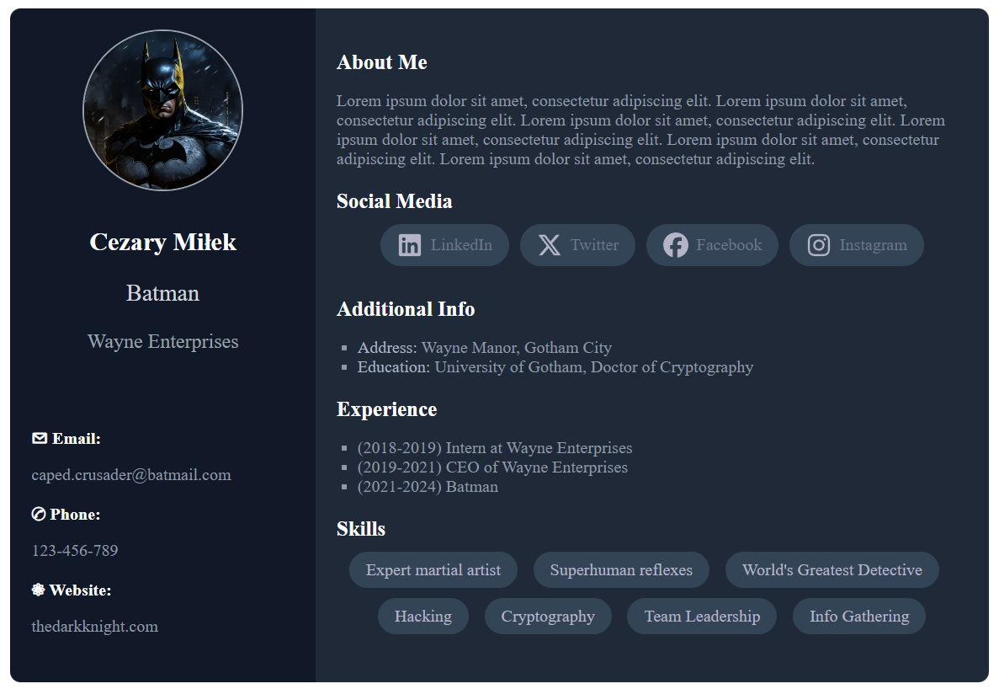
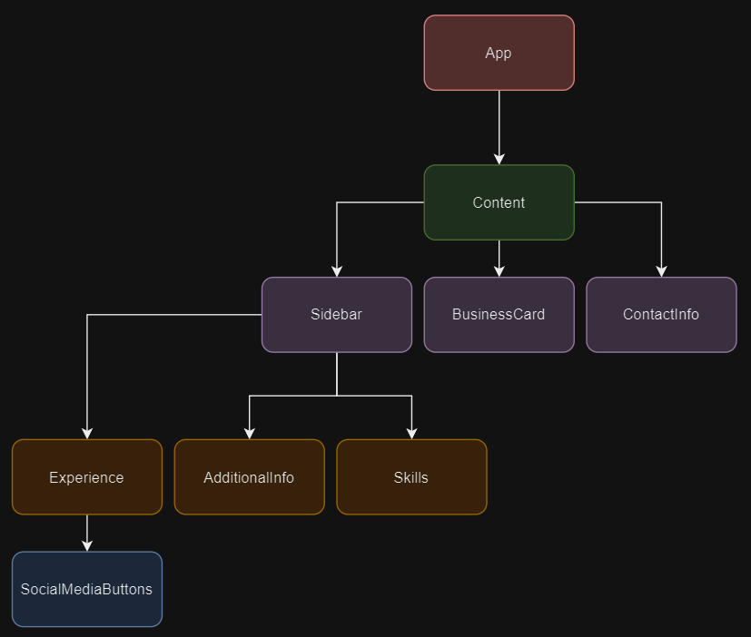

# Pracownia 1: Business Card (5p)
>https://github.com/Arsenicro/uwr2024-react/blob/main/Lecture01/Lab/Lab.md

Twoim zadaniem na pierwszej pracowni będzie stworzenie karty biznesowej w Reactcie, podobnej do tej na [załączonym obrazku](images/card.png).

## Środowisko

Załóż konto na [codesandbox.io](https://codesandbox.io). Stwórz nowy sandbox, React z TypeScriptem. To będzie twoje środowisko w tym zadaniu.

## Karta

Stwórz kartę biznesową. Styl karty jest dowolny, ale karta powinna zawierać _jakieś_ style, które sprawią, że będzie wyglądała schludnie. Można oczywiście odtworzyć kartę z załączonego obrazka.

## Podział na Komponenty

Istotną częścią tego zadania jest zadbanie o odpowiedni podział na komponenty. Dopilnuj, by twój kod zawierał możliwie najmniej powtórzeń, oraz, by każda logicznie osobna część była osobnym komponentem.

_Uwaga: W prawdziwym świecie czasem nie chcemy rozdrabniać komponentów zbyt bardzo. Mimo to, jak wiele zadań na tych studiach, to zadanie ma mało wspólnego z rzeczywistością i ma ono nauczyć dzielenia kodu na komponenty._

Przygotuj (używając narzędzi typu miro, microsoft whiteboard czy draw.io) drzewko komponentów, podobne do tego zaprezentowanego na wykładzie. Dla każdego komponentu prowadzący ma prawo zapytać do czego on służy, czemu jest wydzielony i czy nie da się go bardziej podzielić (albo czemu jest podzielony aż tak bardzo). Oddając zadanie zdalnie opis dla każdego komponentu należy przedstawić w formie pliku tekstowego.

---
## Prezentacja

### Karta

### Diagram klas
