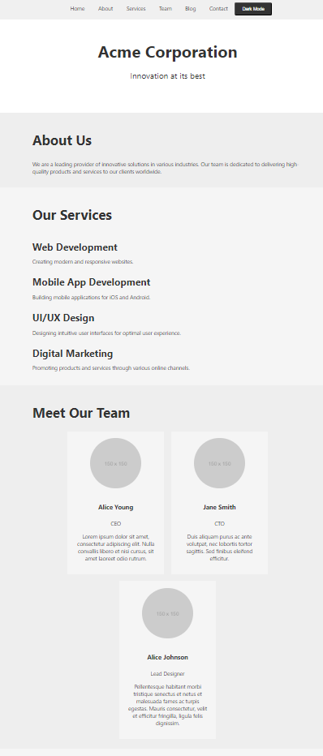

# React + TypeScript + Vite
---
# Pracownia 5: Refactoring (10p)
> https://github.com/Arsenicro/uwr2024-react/blob/main/Lecture05/Lab/Lab.md

Twoim zadaniem na tej pracowni będzie poprawienie kodu wygenerowanego za pomocą sztucznej inteligencji, znajdującego się [tutaj](https://codesandbox.io/p/sandbox/new-wind-4k58gm).

Celem będzie stworzenie **dwóch** aplikacji: jedną z użyciem [scss](https://sass-lang.com/), a jedną z użyciem [emotion](https://emotion.sh).

## Termin i punktacja

Terminem zadania są pierwsze zajęcia odbywająca się po 1 kwietnia.

Z uwagi na większy czas na zrobienie pracowni, pracownia jest warta ponad 10 punktów.

## Środowisko

Użyj [vite](https://vitejs.dev/) do stworzenia lokalnej instancji Reacta. Koniecznie użyj Reacta z TypeScriptem.

## Zasady

1. Strona powinna wyglądać wizualnie identycznie do tej wygenerowanej przez sztuczną inteligencję.
2. Należy zadbać o dobry podział na komponenty. Nie tylko na sekcje, ale także komponenty funkcjonalne, takie jak `team-card`, `blog-card`, `contact-form` czy choćby `section`.
   1. Pamiętaj o propsie `children` który może pomóc w stworzeniu choćby komponentu `section`.
3. Dane strony powinny nadal znajdować się w tym samym obiekcie w którym się znajdują, a obiekt powinien znajdować się w pliku `App`. Obiekt nie powinien być eksportowany, wszelkie dane należy przekazywać za pomocą propsów (można też użyć kontekstu).
4. Częścią zadania jest zapoznanie się z dokumentacją użytego rozwiązania.

## SCSS (5p)

Style należy przepisać na [sass](https://vitejs.dev/guide/features#css-pre-processors).

1. Style powinny być podzielone na pliki: jeśli dana klasa używana jest przez konkretny komponent, styl ten powinien znajdować się obok komponentu.
2. Klasy nie powinny konfliktować między plikami: w tym celu należy użyć `scss modules`.
3. W osobnym pliku należy zdefiniować wszystkie zmienne odpowiedzialne za kolory.
4. Light/Dark mode mogą być wykonane w taki sam sposób jak w wersji wygenerowanej przez AI: poprzez dodanie klasy.

## Emotion (8p)

Style należy przepisać na [emotion](https://emotion.sh/docs/introduction).

1. Stylowanie powinno być oparte na komponentach: stylowany powinien być konkretny komponent, nie powinno być jednego obiektu ze wszystkimi stylami.
2. W osobnym pliku powinny znajdować się obiekty z definicjami `light/dark theme` (kolory, być może inne zmienne)
3. Light/Dark mode powinny być zrobione z użyciem `ThemeProvider` odpowiedniej biblioteki: odpowiednie kolory należy nadawać używając [Themingu](https://emotion.sh/docs/theming) bez użycia dodatkowych klas.

---
## Prezentacja
### SCSS
#### Light mode

#### Dark mode

