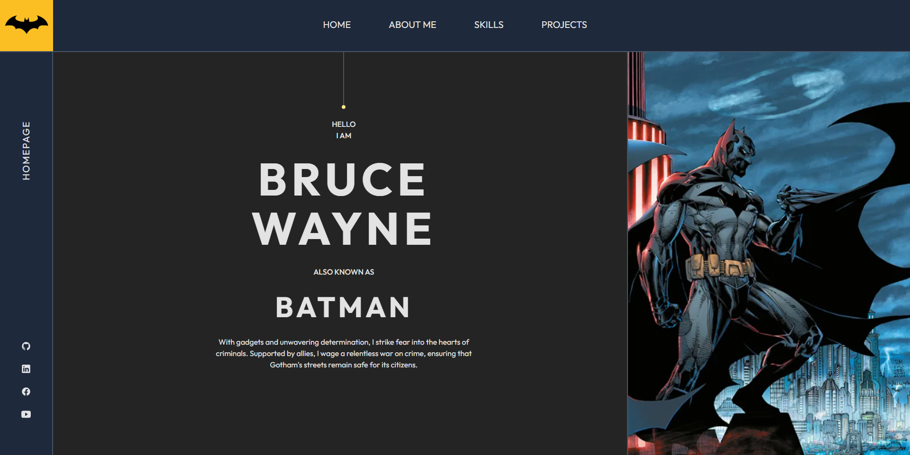
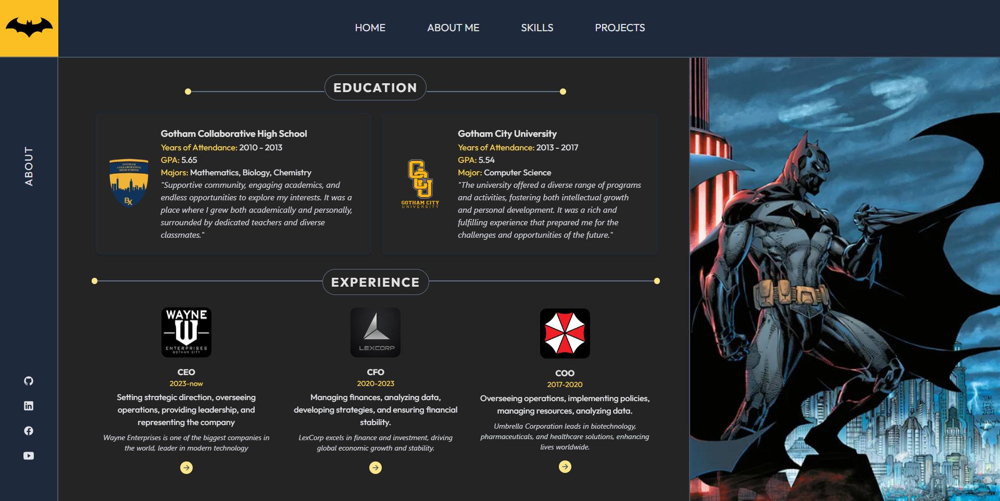
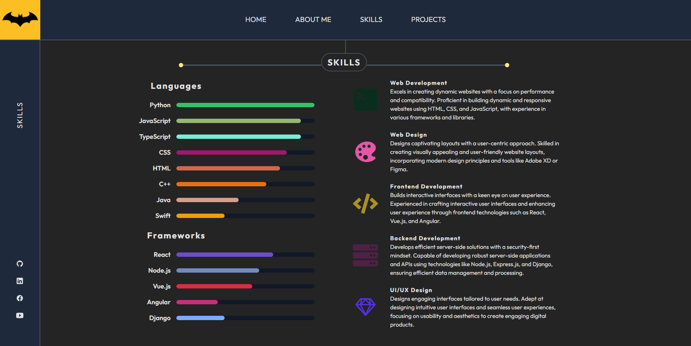

# Pracownia: Portfolio (10p)

Twoim zadaniem na tej pracowni będzie stworzenie [personalnego portfolio](https://arsenicro.github.io) z użyciem Reacta. Stronę wypełnisz (być może nie)swoimi danymi.

Częścią zadania jest znalezienie [inspiracji online](https://scrimba.com/articles/web-developer-portfolio-inspiration/) do stworzenia takiego portfolio.

## Środowisko

Użyj [vite](https://vitejs.dev/) do stworzenia lokalnej instancji Reacta. Koniecznie użyj Reacta z TypeScriptem.

## Style

Sposób stylowania jest dowolny, jednak musi być to sposób przedstawiony na wykładzie. Możesz więc stworzyć własną bibliotekę komponentów z użyciem [Radix Primitives](https://www.radix-ui.com/primitives)/[BaseUi](https://mui.com/base-ui/getting-started/) i dodając style z użyciem CSS/[Sass](https://sass-lang.com/)/[Tailwind](https://tailwindcss.com/), albo użyć gotową bibliotekę komponentów taką jak [MaterialUi](https://mui.com/material-ui/) czy [AntD](https://ant.design/). 

Możesz też użyć (po konsultacji z prowadzącym), dowolnej innej biblioteki.

## Ocena

Oceniany będzie zarówno aspekt wizualny (czy strona jest schludna i wizualnie przyjemna: wykonywanie podpunktów "po najmniejszej linii oporu" będzie skutkowało odjęciem punktów), funkcjonalny (czy zawiera wszystkie opisane niżej funkcjonalności) jak i odpowiednia argumentacja użytych rozwiązań.

Zadanie to może być bodźcem do stworzenia swojego prawdziwego portfolio, które w przyszłości będziesz rozwijać. Możesz więc dowolnie rozszerzyć zakres opisany poniżej.

Nie będzie oceniana wartość merytoryczna strony: jeśli nie chcesz wypełniać jej swoimi danymi, możesz użyć dowolnej zawartości.

## Funkcjonalności

1. Strona będzie składała się z (minimum) 3 podstron.
	1. Podstrony **muszą być** stworzone za pomocą jednych z poznanych na wykładzie rozwiązań do routingu: [React Router](https://reactrouter.com/en/main) albo [TanStack Router](https://tanstack.com/router/latest).
	2. Na górze lub z boku strony, widoczna ze wszystkich podstron, powinna znajdować się nawigacja, pozwalająca na poruszanie się między podstronami.
2. Strona "Home":
	1. Strona z krótkim (1-2 zdaniowym) opisem, wraz z linkami do social mediów.
	2. Możesz zawrzeć zdjęcie lub logo,
	3. Strona powinna być stroną domyślną.
3. Strona "About Me"
	1. Strona zawierająca bardziej szczegółowy opis oraz (tym razem już koniecznie) zdjęcie lub logo.
	2. Strona powinna zawierać "edukację": listę szkół/uczelni wraz z latami uczęszczania, i krótkim opisem.
	3. Strona powinna zawierać "doświadczenie": listę firm wraz z latami pracy i krótkim opisem Twoich odpowiedzialności.
		1. Lista powinna zawierać przynajmniej 2-3 elementy: jeśli twoje doświadczenie zawodowe nie jest wystarczające żeby to wypełnić, tymczasowo wpisz swoje wymarzone firmy.
	4. Strona powinna zawierać "umiejętności": listę kilku najważniejszych technologii/języków/frameworków/bibliotek których znajomością chcesz się pochwalić.
4. Strona "Projects":
	1. Strona zawierająca listę najważniejszych projektów, którymi chcesz się pochwalić.
		1. Każdy projekt powinien zawierać nazwę, listę użytych technologii, krótki opis i linki: do kodu i opcjonalnie do wersji "live".
		2. Lista powinna zawierać przynajmniej 4-5 elementów: jeśli nie masz jej czym wypełnić, możesz zamiast tego uzupełnić listę o strony/aplikacje których używasz na co dzień.

---
## Prezentacja

