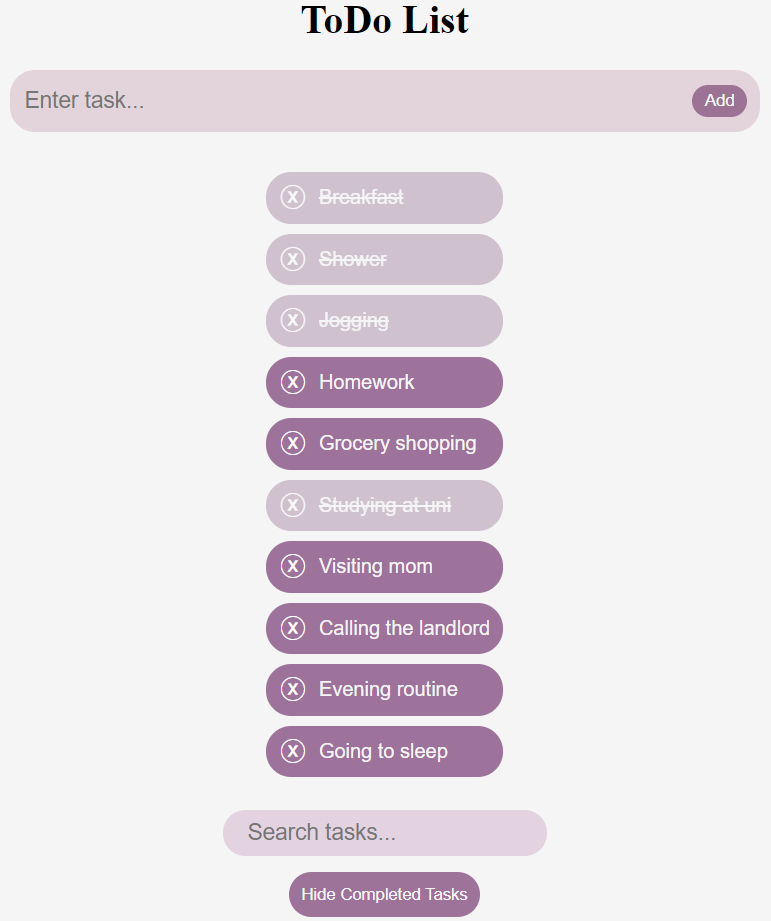
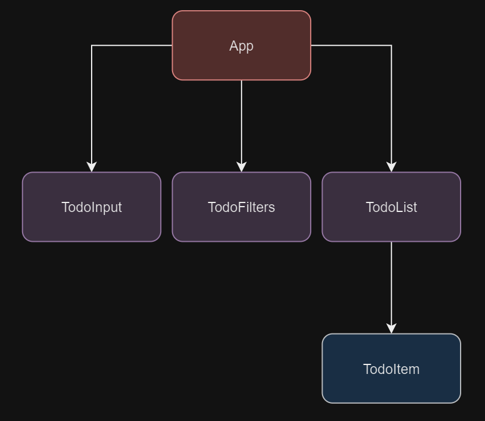

# Pracownia 2: ToDo List (8p)
> https://github.com/Arsenicro/uwr2024-react/blob/main/Lecture02/Lab/Lab.md?plain=1

Twoim zadaniem na drugiej pracowni będzie stworzenie ToDo listy.

## Środowisko

Załóż konto na [codesandbox.io](https://codesandbox.io). Stwórz nowy sandbox, React z TypeScriptem. To będzie twoje środowisko w tym zadaniu.

**Dla ambitnych**: za dodatkowe _0_ punktów (nie jest to literówka) można użyć [vite](https://vitejs.dev/). Jest to opcja dla osób które już wiedzą jak postawić środowisko lokalnie: w najbliższej przyszłości rozwiązanie to będzie omówione na wykładzie i stanie się naszym głównym sposobem pisania aplikacji.

## Funkcjonalności

1. ToDo lista powinna zawierać podstawowe style, które sprawią, że będzie wyglądała schludnie
2. ToDo lista powinna mieć możliwość dodawania, usuwania, i oznaczania zadań jako zrobionych
3. Każdy stan powinien być odpowiednio wizualnie zaakcentowany poprzez dodanie odpowiedniej klasy (w dowolny sposób)
4. Lista powinna mieć możliwość _odfiltrowania_ elementów które zostały oznaczone jako zrobione (powinien być to proces odwracalny)
5. Lista powinna mieć opcję filtrowania względem nazwy: po wpisaniu tekstu, na liście powinny zostać tylko elementy które zawierają ten tekst

## Podział na Komponenty

Przygotuj (używając narzędzi typu miro, microsoft whiteboard czy draw.io) drzewko komponentów, podobne do tego zaprezentowanego na wykładzie. Dla każdego komponentu prowadzący ma prawo zapytać do czego on służy, czemu jest wydzielony i czy nie da się go bardziej podzielić (albo czemu jest podzielony aż tak bardzo). Oddając zadanie zdalnie opis dla każdego komponentu należy przedstawić w formie pliku tekstowego.

---
## Prezentacja
### Todo lista

### Diagram
