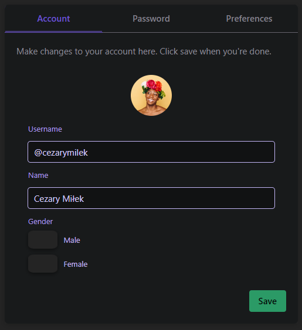
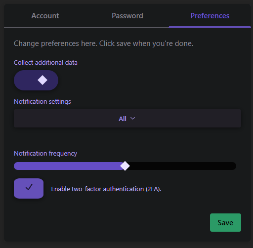

> https://github.com/Arsenicro/uwr2024-react/blob/main/Lecture07/Lab/Lab.md

# Pracownia: Ustawienia (10p)

Twoim zadaniem na tej liście będzie stworzenie prostego formularza ustawień konta.

Formularz **nie będzie funkcjonalny**: zależy nam tylko i wyłącznie na wyglądzie i dostępności (accessibility).

Bardzo istotną częścią tego zadania jest wykorzystanie **niestylowanej** biblioteki komponentów [Radix Primitives](https://www.radix-ui.com/primitives). W tym celu trzeba będzie przeanalizować jej dokumentacje. **Nie wykorzystuj innych bibliotek komponentów, ani `@radix-ui/themes`!**

## Stylowanie

Stylowanie jest istotną częścią zadania: formularz powinien wyglądać schludnie, nie-identycznie do stylów prezentowanych w dokumentacji Radix'a. Do stylowania można wykorzystać CSS modules, SCSS modules lub Emotion. Można też skorzystać z tailwinda, jednak sam tailwind będzie dopiero na kolejnym wykładzie.

## Wymagania Podstawowe (8p)

1. Należy używać przede wszystkim komponentów z Radix Primitives jako bazy. Jeśli do czegoś nie ma komponentu (`input`, `fieldset`), należy użyć natywnego HTMLowego pola.
   1. W szczególności, w przykładowym rozwiązaniu użyte zostały komponenty: `react-label`, `react-radio-group`, `react-select`, `react-slider`, `react-switch` i `react-tabs` -- rozwiązanie powinno używać przynajmniej tych komponentów.
2. Nie należy używać komponentu `Form` -- służy on głównie do walidacji.
3. Choć sam formularz nie będzie funkcjonalny, należy zadbać o to by łatwo dało się użyć podejścia kontrolowanego w celu wydobycia wartości pól (to znaczy trzymania wartości pól w stanie).
4. Formularz będzie złożony z zakładek
   1. Każda z zakładek będzie zawierała (niefunkcjonalny) przycisk zapisu
   2. Każda z zakładek zawierać będzie header
5. Formularz _nie musi być_ walidowany
6. Każde pole powinno zawierać label, połączony za pomocą `htmlFor` do `id` elementu
7. Wszystkie pola powinny być otoczone elementem `fieldset`
8. Zakładki i zawartość formularza:
   1. Zakładka `Account`
      1. Powinna zawierać header "Make changes to your account here. Click save when you're done."
      2. Powinna zawierać pola `name`, `username` i radio group `gender` (możliwość zazanczenia dokładnie jednej opcji).
   2. Zakładka `Password`
      1. Powinna zawierać header: "Change your password here. After saving, you'll be logged out."
      2. Powinna zawierać pola `current password`, `new password` i `repeat password`
   3. Zakładka `preferences`
      1. Powinna zawierać header: "Change preferences here. Click save when you're done."
      2. Powinna zawiera pola `notification settings` (select z 3 opcjami: `All`, `Only Followed` i `None`), `notification frequency` (slider) oraz `collect additional data` (switch)

## Rozszerzenie (2p)

Jako dodatkowe rozszerzenie należy rozbudować formularz używając przynajmniej dwóch dodatkowych elementów z biblioteki [Radix Primitives](https://www.radix-ui.com/primitives).
Można w tym celu rozbudować formularz, dodać nową sekcję, nowe pole, a nawet zbudować coś wokół formularza, jak pasek nawigacyjny.

Elementy powinny być inne niż te używane w wersji podstawowej. Nie powinien być to też komponent `Form` (jego funkcję być może będziemy omawiać w przyszłości).

Rozszerzenie nie musi być funkcjonalne, ale jego zrobienie powinno mieć sensowne uzasadnienie.

## Dodatkowe uwagi

Oceniana będzie czytelność kodu, zarówno css-owego jak i js-owego. Należy zadbać o odpowiedni podział na komponenty: każdy element formularza (input, select, slider itd.) powinien posiadać swój folder w folderze `components`, w którym będą wszystkie dane do renderowania komponentu (style, funkcjonalności, typy).

## Przykład

Przykładowa aplikacja: [account](images/account.png), [password](images/password.png), [preferences](images/preferences.png).

---
## Prezentacja

